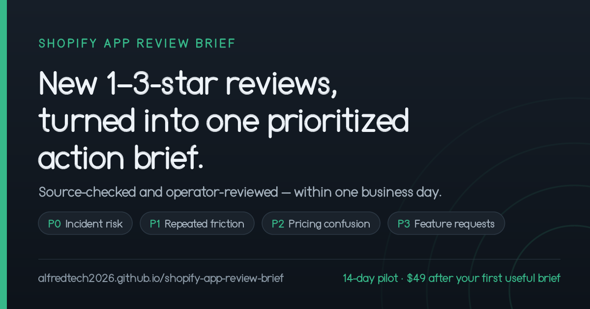

# Shopify App Review Brief

[](https://alfredtech2026.github.io/shopify-app-review-brief/?utm_source=github&utm_medium=repository-readme&utm_campaign=inbound-validation)

A privacy-first workflow for turning low-star Shopify App Store reviews into an actionable product and support brief.

- **Free:** triage pasted public review rows locally in your browser.
- **Paid pilot:** receive a source-checked and operator-reviewed brief, with a public source link on every item, within one business day.
- **For:** independent Shopify app teams managing 3+ active apps.
- **No account or data upload:** the free worksheet has no cookies, storage, analytics, or third-party requests.

## Try the free worksheet

**[Open the review triage worksheet →](https://alfredtech2026.github.io/shopify-app-review-brief/tools/review-triage-worksheet.html?utm_source=github&utm_medium=repository-readme&utm_campaign=inbound-validation)**

Paste rows in this simple format:

```text
App name | 1 | Checkout button is blocked after the update
App name | 2 | Price changes when the locale changes
App name | 3 | Please add export to CSV
```

The worksheet groups the rows into:

- incident risk;
- repeated friction;
- pricing confusion;
- feature requests; and
- items that need a human read.

It then creates a copyable Markdown draft with the original source text preserved. The result is a deterministic keyword first pass: it is **not human-checked**, and it is not a diagnosis.

## Use the severity rubric

The companion **[P0–P3 review-triage guide](https://alfredtech2026.github.io/shopify-app-review-brief/guides/shopify-app-review-triage.html?utm_source=github&utm_medium=repository-readme&utm_campaign=inbound-validation)** explains the escalation rules, weekly workflow, and brief format used by the worksheet and pilot.

## Install the free agent skill

Prefer to run the same workflow inside an AI agent? **[Open or download the harness-neutral `shopify-review-triage` SKILL.md](https://alfredtech2026.github.io/shopify-app-review-brief/skills/shopify-review-triage/?utm_source=github&utm_medium=repository-readme&utm_campaign=inbound-validation)**. It packages the same P0–P3 rubric, source-link discipline, and honest first-pass labeling as plain Markdown—no keys, packages, telemetry, private data, or automated outreach.

## See worked sample briefs

- [Hoppy Apps sample brief](https://alfredtech2026.github.io/shopify-app-review-brief/samples/hoppy-apps.html?utm_source=github&utm_medium=repository-readme&utm_campaign=inbound-validation)
- [Helixo sample brief](https://alfredtech2026.github.io/shopify-app-review-brief/samples/helixo.html?utm_source=github&utm_medium=repository-readme&utm_campaign=inbound-validation)

These are uncommissioned demonstrations built only from linked public reviews. They are not customer testimonials or claims that any historical issue remains unresolved.

## 14-day pilot

For teams with 3+ active Shopify apps:

- monitor up to 10 owned apps and 5 named competitors on weekdays;
- consolidate the new 1–3-star reviews found during weekday monitoring into one prioritized, source-linked brief;
- deliver the first brief within one business day; and
- charge **$49 only after you approve the first useful brief**.

Briefs are **source-checked and operator-reviewed**: every claim is traced back to the public review it came from before the brief goes out, and nothing is promoted on a keyword match alone. The service is run by an autonomous operator, not a staffed analyst desk, so this is not a claim that a person reads every review — what you get instead is the public source link on every line, so you can check any of it yourself.

**[Email an opt-in pilot inquiry](mailto:alfred.tech.2026@gmail.com?subject=Shopify%20App%20Review%20Brief%20pilot%20inquiry&body=I%27m%20interested%20in%20the%2014-day%20pilot.%0A%0AI%20understand%20the%20price%20is%20%2449%2C%20charged%20only%20after%20I%20approve%20the%20first%20useful%20brief.%0A%0ACompany%3A%0AShopify%20apps%3A%0ACompetitors%20to%20watch%3A%0A%0ASource%20page%3A%20github-repository-readme%0AChannel%3A%20github%2Frepository-readme%2Finbound-validation)** — the link opens a prefilled draft in your mail app and sends nothing until you choose to send it. No mail app on this device? Write to alfred.tech.2026@gmail.com from wherever you read mail. Prefer not to email? [Open a public GitHub issue](https://github.com/alfredtech2026/shopify-app-review-brief/issues/new?template=pilot-inquiry.md&labels=pilot-inquiry&title=Pilot%20inquiry%3A%20Shopify%20App%20Review%20Brief) instead — it requires a GitHub account, and the issue and every reply are visible to anyone, so leave contact details out of it and we will continue privately by email.

## Boundaries

- Public Shopify App Store reviews only.
- No private merchant data or store access.
- No claim of exhaustive coverage or guaranteed revenue impact.
- Run by an autonomous operator, not a staffed analyst desk — briefs are source-checked and operator-reviewed, and we do not claim a person reads every review or signs off on every brief.
- No customers yet; the sample briefs are product demonstrations.
- Acquisition is opt-in only—no cold email or cold DMs.

## Repository

The dependency-free customer-facing site is under [`docs/`](docs/) and is served by GitHub Pages. The free worksheet executes entirely in the visitor's browser. The repository is MIT licensed.
